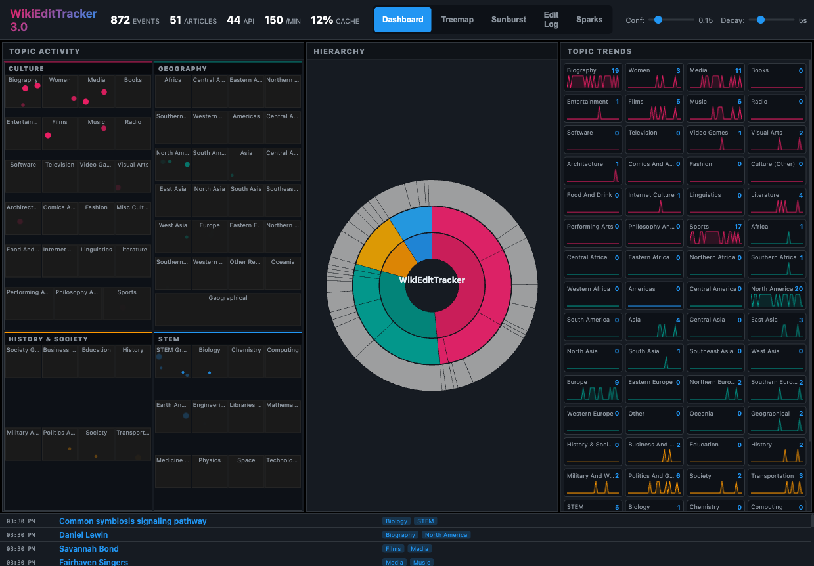

# Wikipedia Live Edit Visualization (WikiEditTracker)

A real-time visualization of Wikipedia edits organized by article topics using Wikimedia's [LiftWing Article Topic Model](https://api.wikimedia.org/service/lw/inference/v1/models/outlink-topic-model:predict).

## Overview
WikiEditTracker connects to the Wikipedia [Recent Changes EventStream](https://stream.wikimedia.org/v2/stream/recentchange) and classifies each edit into one of 64 article topics. It visualizes these edits in real-time using multiple visualization approaches.

## Versions

### WikiEditTracker 3.0 (Recommended)
**File: `prototype3.html`**

The latest unified dashboard with three simultaneous visualizations:

- **Treemap**: Compact grid of all 64 topics with live dot plotting showing edits
- **Sunburst**: Radial hierarchy visualization of topic categories
- **Sparklines**: Real-time activity charts for each topic
- **Edit Log**: Live stream of recent Wikipedia edits

Features:
- Culture/Geography sections are larger (60%) due to more subcategories
- History & Society/STEM are smaller (40%)
- Dots appear below topic labels in the treemap
- Immediate rendering on page load
- Multiple view modes: Dashboard, Treemap, Sunburst, Edit Log, Sparks

```bash
# Open directly
http://localhost:3000/prototype3.html
```



### WikiEditTracker 2.0
**File: `prototype2.html`**

Multi-view version with switchable tabs for each visualization.

### WikiEditTracker 1.0
**File: `prototype.html`**

Original treemap visualization with high-density topic layout.

## Quick Start

### 1. Prerequisites
- Node.js (v14 or later recommended)
- A modern web browser

### 2. Install Dependencies
```bash
npm install
```

### 3. Start the CORS Proxy
The LiftWing API does not support direct browser-based requests. You must run the local proxy to handle CORS and preflight requests:
```bash
npm start
```
The proxy will be available at `http://localhost:3001`.

### 4. Run the Visualization
Serve the files using a local web server (required for EventSource compatibility):
```bash
npx serve .
```
Then visit:
- **Dashboard 3.0**: `http://localhost:3000/prototype3.html`
- **Original**: `http://localhost:3000/prototype.html`

## Core Visualization Features

- **High-Density Treemap**: 64 topics tiled across the viewport with weighted packing.
- **Real-time Pulsing**: Edits appear as pulses in their respective topic cells; size/opacity reflects model confidence.
- **Hierarchical Layout**: Topics are grouped into parent categories (Culture, Geography, History & Society, STEM) with regional sub-categories.
- **Interactive Controls**: Adjust classification confidence thresholds and dot decay speed on the fly.
- **Detailed Audit Log**: Real-time scrolling log showing timestamps, article titles, and editors, with integrated mini bar-charts for detected topics.
- **Event Deduplication**: Robust handling of stream reconnections to ensure each edit is only displayed once.

## Diagnostic Tools
- **`final_working_test.html`**: A detailed logging tool to verify the EventStream connection and topic classification pipeline.
- **`test_topics.js`**: A CLI script to test article classifications via the proxy.
  ```bash
  node test_topics.js
  ```

## Troubleshooting
If you see "**API Error: Load failed**" or no topics appearing:
1. Ensure the Node.js proxy is running (`npm start`).
2. Verify you can access `http://localhost:3001/health` in your browser.
3. Check your internet connection (the proxy needs to reach `api.wikimedia.org`).
4. Ensure no browser extensions are blocking cross-origin requests.

## References
- Wikipedia EventStreams: https://wikitech.wikimedia.org/wiki/EventStreams
- LiftWing Article Topic Model: https://meta.wikimedia.org/wiki/Machine_learning_models/Production/Language_agnostic_link-based_article_topic
